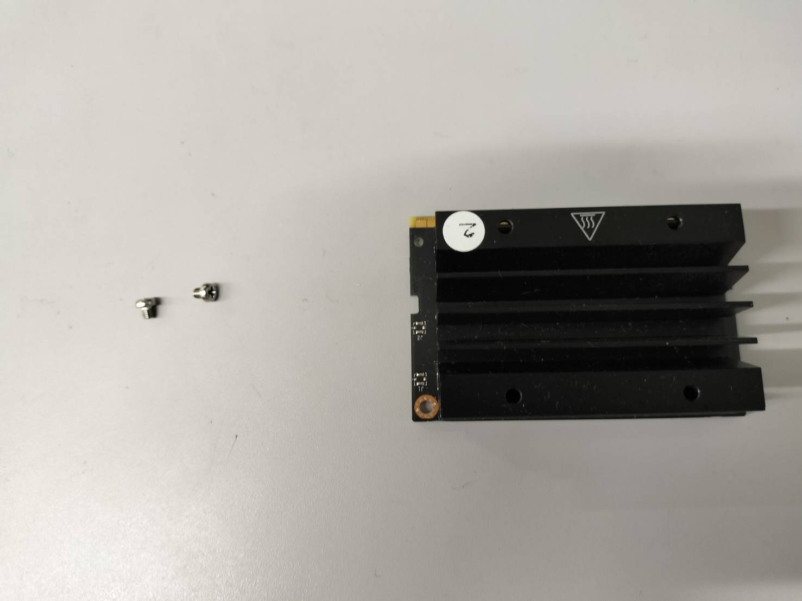
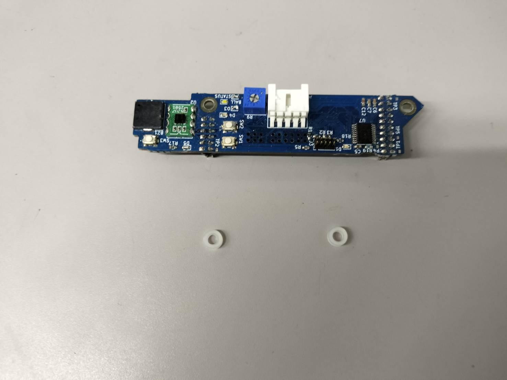
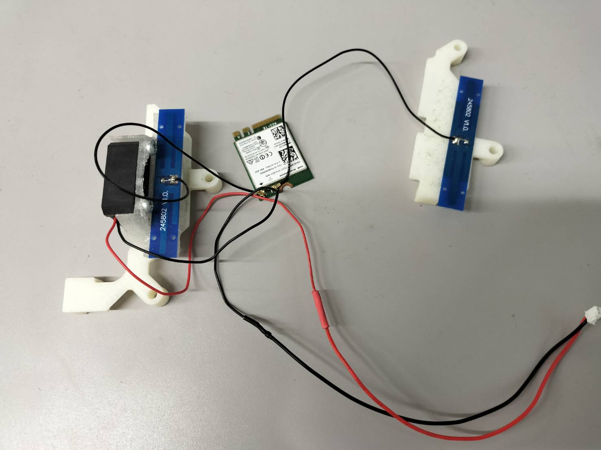
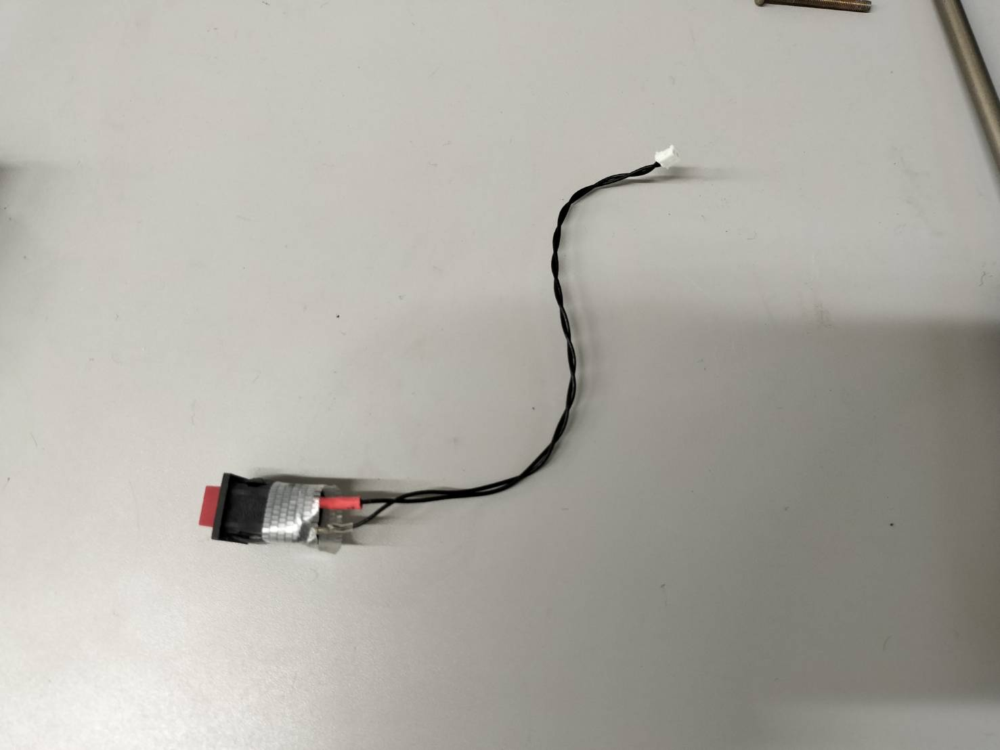
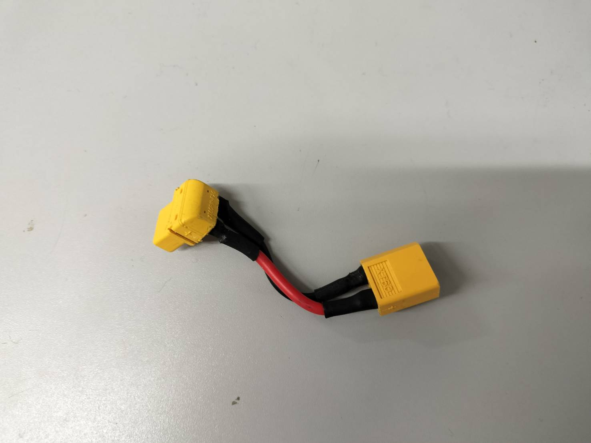

# phoenix基盤組み立て

以下の部品を用意します

- jetson
- jetson用ねじ2本

- extention基盤
- スペーサー2個 

- wifiカード
- アンテナ
- ファン

(写真は組み立て済みのもの)

- スイッチ

- lipoバッテリー用コネクター

phoenix 基盤を用意します

.jpg)

wifiカードなどを以下のように取り付けます

.jpg)

wifiカードをねじで固定します。

.jpg)

ファンの電源コネクタを基盤と接続します。

.jpg)

スイッチを基盤と接続します。

.jpg)

jetsonを差し込みます。

.jpg)

カチッというまで押し込み、その後ねじで固定します。

この時にアンテナなどのケーブルに負荷がかからないようにしてください。

.jpg)

スペーサーを置いて

.jpg)

extention基盤を差し込みます

.jpg)

基盤をプリンターパーツに乗せて、ねじを締めます。

スイッチをプリンターパーツに取り付けます。
（必要ならテープで固定します）

.jpg)

完成
（多少下にねじが出ていても大丈夫です）

.jpg)

