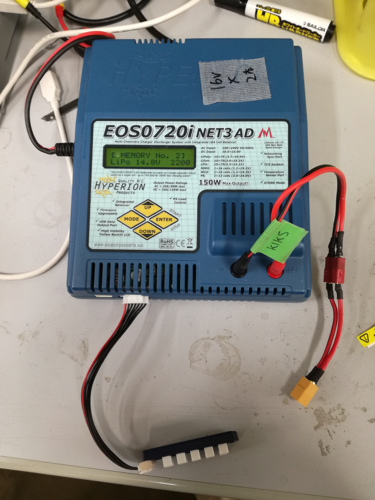
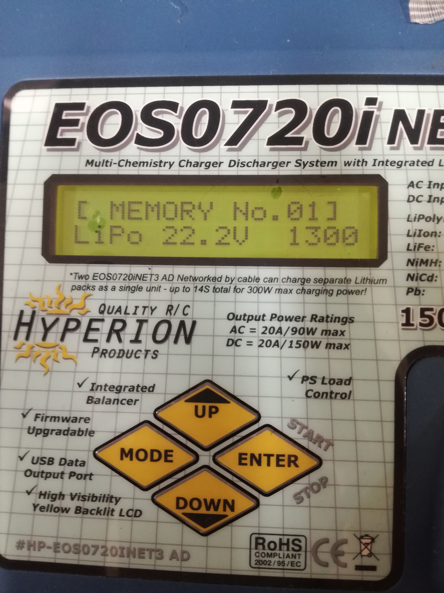
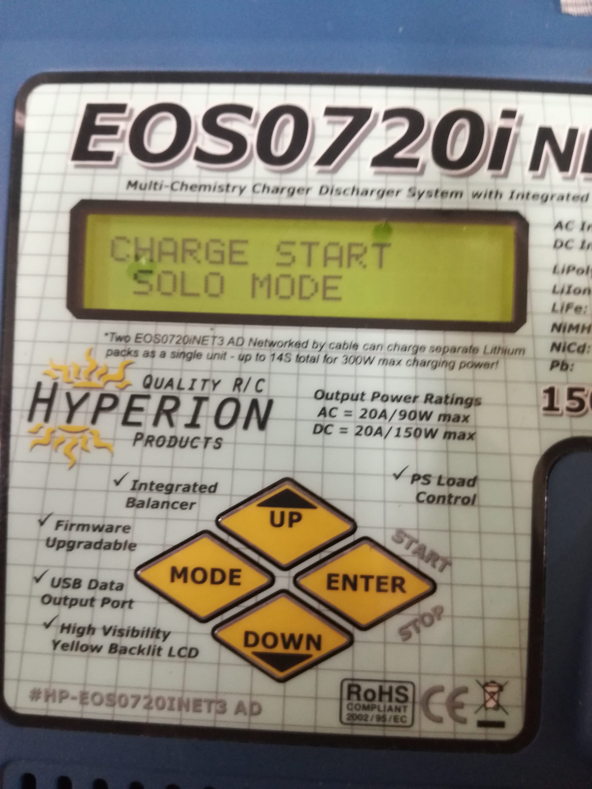
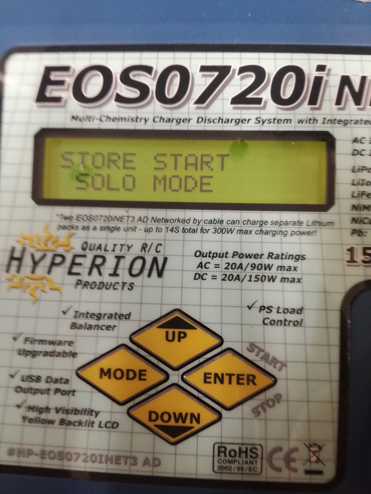

# LiPoの保管方法
　LiPoは利用前に充電し、利用後に適切な電圧に放電する必要があります。そのため、試合の前後にLiPoの充放電を行う必要があります。

# LiPoの電圧チェックの方法
テスターを用いてバッテリーの起電力を測定してそれをセル数で割、一セルあたりの電圧(セル単位電圧とする)を計算します。そして、セル単位電圧により、判別を行います。

目安となる電圧換算表

|電圧[V/Cell]|状態|コメント|
|--|--|--|
|4.2~|過充電|異常な状態です。放電してください|
|4.０~4.2|充電状態|試合終了後、放電をしてください|
|3.8~4.0|準充電状態|一試合もつかわかりません|
|3.5~3.8|安全放電域|試合を行うのであれば充電してください|
|3.3~3.5|警告放電域|ロボットから外してください|
|~3.3|危険放電域|異常な状態です。但しにロボットから外してください、充電してください｜

LiPoの保存状態となるセル単位電圧は3.6[V/Cell]です。そこから0.2[V/Cell]ほど離れていた場合は保存状態になるようにStoreしてください。

# 充電器の使い方
## 作業
1. 充電器に電源を接続してください。  

2. 充電器とバッテリーを、太い電源端子、細いバランス端子の順で接続してください。  
  
3. 電圧と容量が一致する画面にし、`ENTER`を押してください。(TODO profileの移動のボタン忘れたので追記)
[メモ] 6 Cell なら22.2[V],4 Cellなら１４．８[V]  
  
4. 充電ならば、`charge start`で`ENTER`を押して充電を開始し、放電ならば,`store start`で`ENTER`を押してください。その後、充電器によりバッテリの適合チェックがなされます。もし、適合チェックが通らない場合は、作業を中断してください。
  
  
