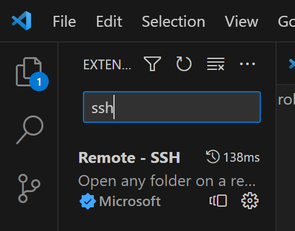
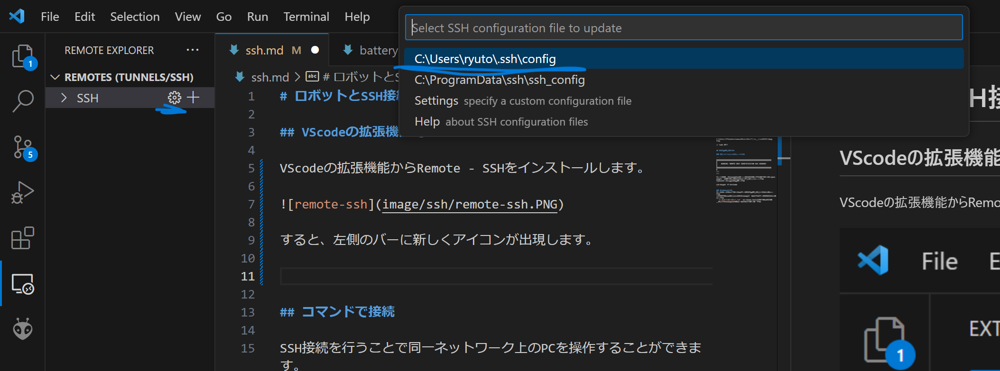
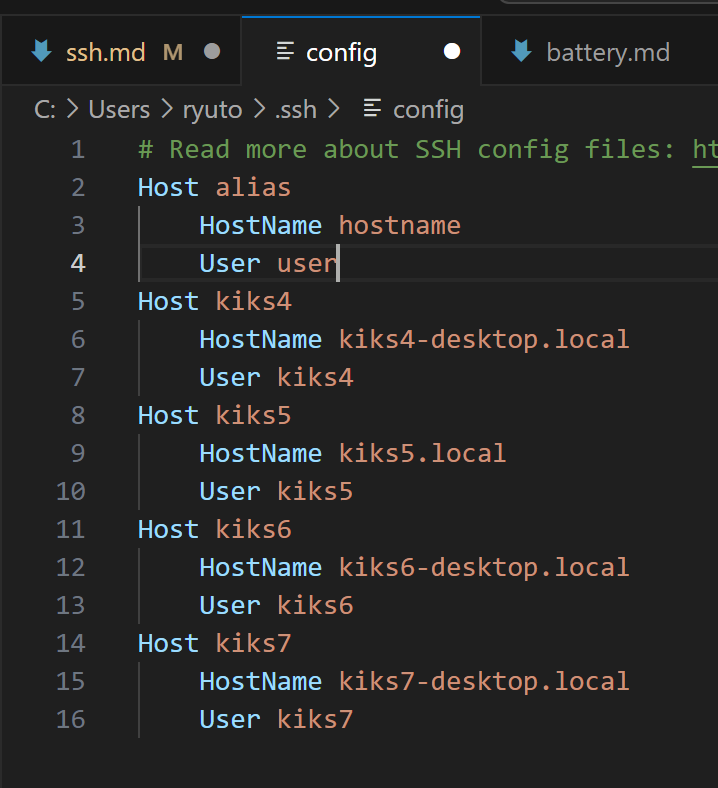
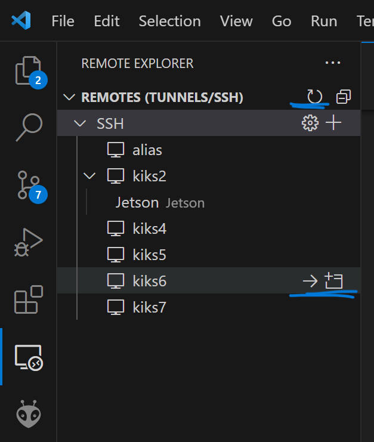

# ロボットとSSH接続する方法

## コマンドで接続

SSH接続を行うことで同一ネットワーク上のPCを操作することができます。

1.PCをロボットと同じネットワークに接続します。

有線で行う場合はロボットの中央のポートとPCをUSBで接続します。

2.ターミナルを開いて以下のコマンドを打ち込みます
```
ssh kiks番号@kiks番号-desktop.local
```
パスワードを聞かれるので``soccer``と入力してしばらく待ちます。

3.以下のように、hostnameの表示が切り替わったらssh接続完了です。

// todo 写真

## VScodeの拡張機能で接続

VScodeの拡張機能からRemote - SSHをインストールします。



すると、左側のバーに新しくアイコンが出現します。

そして、左側の歯車マークを押し、`C:\User\~~\.ssh\config`を選択します。



ファイルが開くので、以下のようにファイルを編集します。
- Host : VScode上に表示される名前です。わかりやすい名前をつけましょう。
- HostName ssh先のIPアドレスです。

- User ssh先のユーザー名です。



編集し終えたら保存してファイルを閉じます。
その後、REMOTESの右にあるrefreshボタンを押すと以下のような画面となります。

最後に、ssh接続が可能な状態で開きたいremoteの右にあるボタンを押すと、新しくウィンドウが開きssh接続を行うことができます。



VScodeで接続するメリットには以下のようなものがあります。
- git のusername passwordを自動入力してくれる。
- GUIで接続先のファイルを直接編集できる

## 接続できない場合

### エラーメッセージが出る場合

```
@@@@@@@@@@@@@@@@@@@@@@@@@@@@@@@@@@@@@@@@@@@@@@@@@@@@@@@@@@@
@    WARNING: REMOTE HOST IDENTIFICATION HAS CHANGED!     @
@@@@@@@@@@@@@@@@@@@@@@@@@@@@@@@@@@@@@@@@@@@@@@@@@@@@@@@@@@@
~~~
~~~
```
以前保存したこの情報と、いままさに接続しようとしているサーバの情報が一致していないと、このようなエラーが出ます。
以下のコマンドで修正できます。
```
ssh-keygen -R hostname
```

### Windowsの場合
有線と無線を切り替えると、うまく接続できなくなることがあります。
そういう時は、過去のssh接続の情報を一度消すとうまくいくことがあります。
```C:\Users\ユーザー\.ssh```の中known_hostsを編集し、接続したいホストの情報を消し、再度SSHを試しましょう。